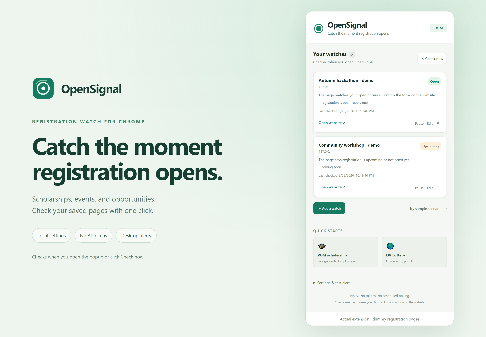
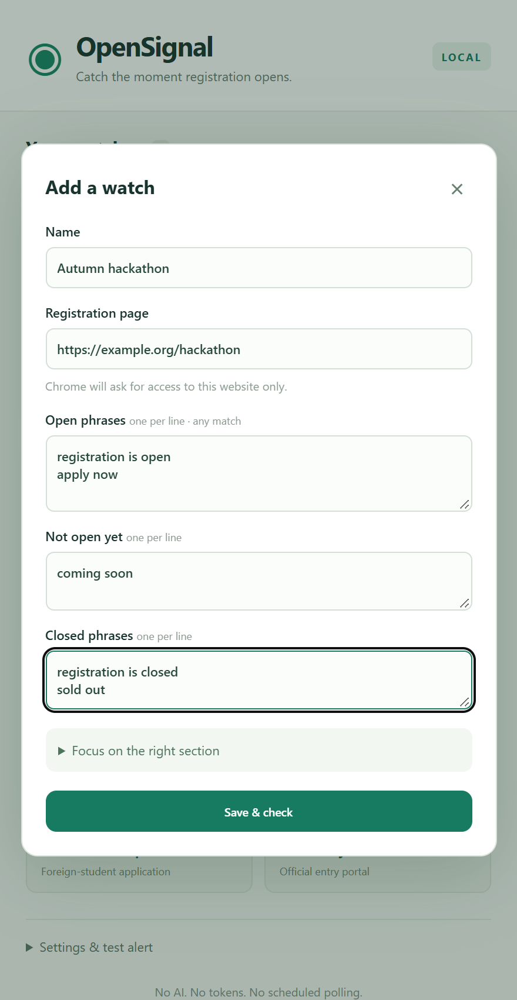
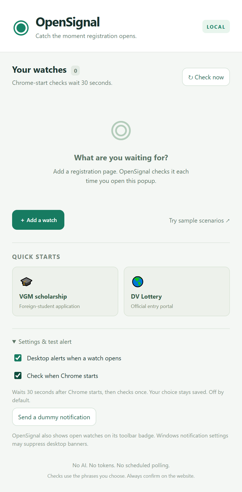
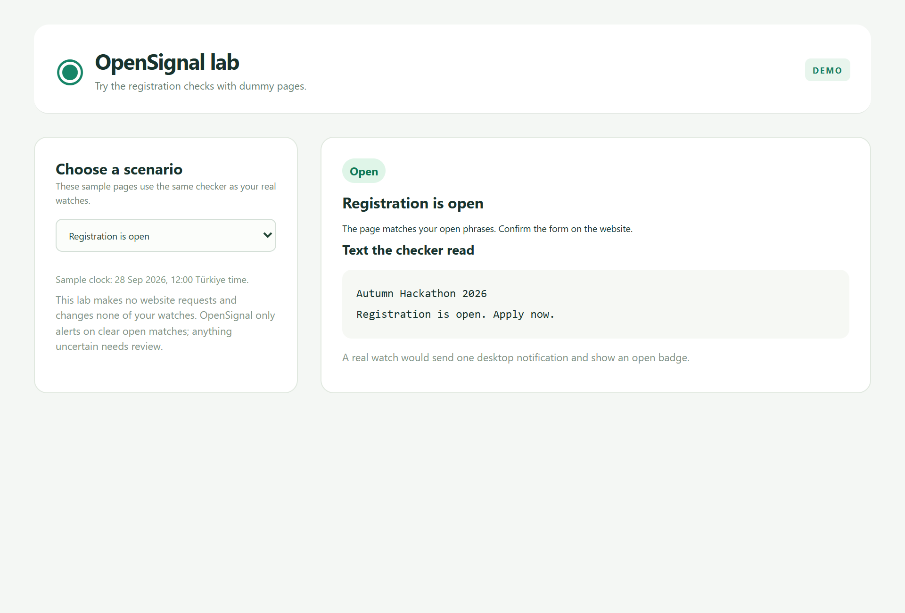

# OpenSignal

**Catch the moment registration opens.**

A lightweight Chrome extension for scholarship applications, event sign-ups, ticket releases, and other opportunities. Save a registration page, tell OpenSignal what opening wording to look for, and check your watches by clicking its toolbar icon.

[**Download OpenSignal.zip**](https://github.com/Ferdaws-c/OpenSignal/releases/latest/download/OpenSignal.zip) · [Install on your PC](docs/INSTALL.md) · [Beginner's how-to guide](docs/HOW-TO.md) · [Test report](TEST-REPORT.md)

> **When does it check?** Every time you open the extension popup or click **Check now**. Enable **Check when Chrome starts** for one automatic check 30 seconds after your Chrome profile starts; this option is off by default. There is no scheduled polling. An opening that happens and ends between checks can be missed.

## What it does

- Saves up to 50 registration watches.
- Optionally checks once, 30 seconds after Chrome starts, without opening the extension popup.
- Shows **Open**, **Upcoming**, **Closed**, or an explanation when a page needs review.
- Sends a desktop notification when a watch first appears open, and shows a green toolbar badge.
- Includes starters for the VGM foreign-student scholarship and the official DV Lottery entry portal.
- Lets you add any normal web page with your own matching phrases.
- Keeps your settings and results locally in your Chrome profile.
- Includes 16 dummy scenarios so you can see how the checks work.

No account, subscription, API key, or AI tokens are needed. It uses ordinary internet data when checking pages. The extension package is about 60 KB; this repository also includes documentation, screenshots, and tests.

**It is a reminder tool.** It does not fill in forms, submit applications, guarantee eligibility, or reserve a place. Always visit the official website to confirm and register.

## Install in Chrome on Windows

You do not need Git, Node.js, coding skills, or a GitHub account.

1. [Download OpenSignal.zip](https://github.com/Ferdaws-c/OpenSignal/releases/latest/download/OpenSignal.zip).
2. In Windows File Explorer, right-click the ZIP and choose **Extract All**.
3. Keep the extracted folder somewhere permanent, such as **Documents → OpenSignal**.
4. Open Chrome, type `chrome://extensions` in the address bar, and press **Enter**.
5. Turn on **Developer mode** at the top right.
6. Click **Load unpacked**. Select the extracted folder that contains **manifest.json**.
7. Click Chrome's puzzle-piece icon and pin **OpenSignal**.
8. Click the OpenSignal icon to start.

If Chrome says it cannot find the manifest, open the extracted folder and look one folder deeper. Select the folder containing `manifest.json`, not the ZIP.

**Keep that folder after installation.** Chrome loads the extension from it. This is an unpacked extension, rather than a Chrome Web Store listing. Chrome 120 or later is required.

[Read the full installation guide, including common fixes →](docs/INSTALL.md)

## Your first alert

### Use a starter

Click **VGM scholarship** or **DV Lottery**. Review the name and page address, then click **Save & check**. Allow access to that website if Chrome asks.

The VGM starter targets the foreign-student scholarship and the **2026-2027** round. Edit the year for future rounds. The DV starter looks for an active **Begin Entry** control; a results/status-check page does not count as registration. These starters are configurable rules, not a statement that registration is currently open.

### Add an event or another opportunity

Click **Add a watch**, then fill in:

| Field | What to enter |
| --- | --- |
| Name | Something you recognize, such as “Autumn hackathon” |
| Registration page | The official event or application page address |
| Open phrases | Exact wording such as `registration is open` or `apply now`, one phrase per line |
| Not open yet | Wording such as `coming soon` |
| Closed phrases | Wording such as `registration is closed` or `sold out` |

Click **Save & check** and approve website access if asked. Next time you click the extension, it checks the saved page again.

Choose phrases from the actual page. Avoid very broad words such as “open”; they may refer to unrelated content. If the page contains old announcements, expand **Focus on the right section** and add the current event name or registration year.

[Follow the beginner's guide with a worked example →](docs/HOW-TO.md)

## Check automatically when Chrome starts

Expand **Settings & test alert** in the popup and enable **Check when Chrome starts**. The setting saves automatically and is off by default. It remembers your on/off choice across restarts and updates. When enabled, it waits 30 seconds after this Chrome profile starts, checks your enabled watches once, then stops. Chrome may run the check later if the computer is busy or asleep.

Turning the option off cancels a pending startup check. Opening the popup or pressing **Check now** checks immediately and replaces the pending startup check, avoiding an extra fetch.

Opening another Chrome window while the profile is already running does not trigger a startup check. If Chrome keeps running in the background, use its menu → **Exit**, then reopen it to test the setting. [Read the startup-check guide](docs/HOW-TO.md#check-automatically-when-chrome-starts).

## Understand the result

| Result | What it means | What to do |
| --- | --- | --- |
| **Open** | Your opening wording matched, or the configured Turkish application window is open | Click **Open website** and confirm registration |
| **Upcoming** | The page says it is not open yet, or its configured date window is in the future | Check again later |
| **Closed** | Closed wording matched, or its configured date window ended | Confirm the next round on the website |
| **Needs review** | Wording is unclear, a section/year is missing, or the page needs JavaScript, login, or verification | Read the page and refine the watch |
| **Check failed** | The page could not be fetched or read | Check your connection and try the website yourself |
| **Enable access** | Chrome has not allowed this website, or access was revoked | Click **Enable access** |
| **Paused** | This watch is disabled | Click **Resume** when you want to check it again |

Closed/upcoming wording takes priority over opening wording. Duplicate notifications are suppressed while the same opening stays active. A definite Upcoming/Closed result prepares the watch to alert on a later opening.

## Try it without waiting for a real opening

Click **Try sample scenarios**. Choose an open event, a sold-out event, a future scholarship window, a wrong year, a blocked page, or a DV registration/status-check scenario.

The lab uses dummy data, makes no website requests, and does not change your saved watches.

For a desktop alert test, expand **Settings & test alert** and click **Send a dummy notification**. Windows Do Not Disturb or notification settings may hide the banner even when Chrome accepts the alert.

## Privacy and website access

OpenSignal stores watch names, URLs, phrases, preferences, and recent results in `chrome.storage.local`. There is no backend, analytics, remote script, external font, or AI request.

It requests access to each website when you save a watch. Page requests omit cookies, so they do not use your logged-in session. It never injects code into your browsing tabs.

The package contains no CV, personal ID, application information, or account credentials. See [the privacy and permissions details](docs/REFERENCE.md#privacy-and-permissions).

## Limits

OpenSignal can read ordinary HTML/text pages. Pages that rely entirely on JavaScript, require login, return a CAPTCHA, publish only PDFs, or change their layout may need manual review. A failed or uncertain check does not prove registration is unavailable.

Keep the round/year and phrases current. Read the official page before acting on an alert.

## Tested with dummy data

**58 rule/request tests, 40 Chrome workflow checks, and 15 delayed Chrome-start checks passed.** The browser checks used an isolated Chrome profile and dummy pages, including changing open/closed states, blocked pages, permission failures, duplicate alerts, and all 16 built-in scenarios.

Chrome's native notification API accepted the test alerts. Visible Windows banners still depend on your notification settings.

[Read the test report and reproduction instructions →](TEST-REPORT.md)

## More details

- [Installation and troubleshooting](docs/INSTALL.md)
- [Beginner's guide](docs/HOW-TO.md)
- [Advanced matching, dates, and permissions](docs/REFERENCE.md)
- [Developer guide](docs/DEVELOPMENT.md)
- [Report a problem](https://github.com/Ferdaws-c/OpenSignal/issues)

Installation follows [Chrome's official instructions for loading an unpacked extension](https://developer.chrome.com/docs/extensions/get-started/tutorial/hello-world#load-unpacked).
