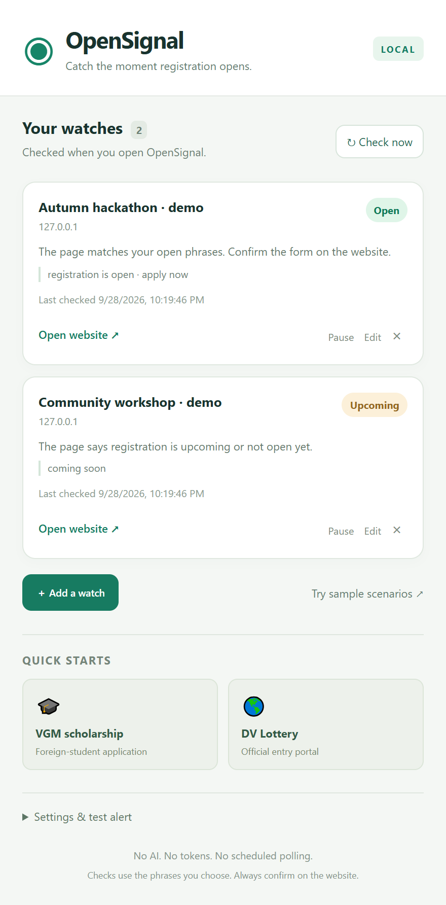

# Install OpenSignal on your PC

This guide is for Windows and Google Chrome. You do not need to code, use a terminal, or create a GitHub account.

## 1. Download it

Click [**Download OpenSignal.zip**](https://github.com/Ferdaws-c/OpenSignal/releases/latest/download/OpenSignal.zip).

Alternatively, open the [latest release](https://github.com/Ferdaws-c/OpenSignal/releases/latest) and click **OpenSignal.zip** under **Assets**. Choose that file for the small ready-to-install package.

## 2. Unzip it

1. Open **File Explorer** and go to **Downloads**.
2. Find **OpenSignal.zip**.
3. Right-click it and choose **Extract All**.
4. Pick a folder you can keep, then click **Extract**.

Unzipping turns the download into ordinary files Chrome can read. Do not select the ZIP itself when installing.

Open the extracted folder. The correct folder has files including:

```text
OpenSignal/
  manifest.json
  popup.html
  background.js
  icons/
```

Depending on the extraction destination, there may be an extra outer OpenSignal folder. Go inside until you can see **manifest.json**.

## 3. Open Chrome's extension page

1. Open **Google Chrome**.
2. Click the address bar at the top.
3. Type `chrome://extensions`.
4. Press **Enter**.

## 4. Load the extension

1. Turn on **Developer mode** in the top-right corner.
2. Click **Load unpacked** at the top left.
3. In the folder picker, select the folder containing **manifest.json**.
4. Click **Select Folder**.

You should see **OpenSignal — Registration Watch** in the extension list.

“Developer mode” lets Chrome load a downloaded extension folder. You do not need to write code.

## 5. Pin it

1. Click the **puzzle-piece icon** near Chrome's address bar.
2. Find **OpenSignal — Registration Watch**.
3. Click its **pin**.
4. Click the OpenSignal icon that appears on the toolbar.



## 6. Set up your first watch

Choose **VGM scholarship**, **DV Lottery**, or **Add a watch**. Review the fields, click **Save & check**, and allow access to the website if asked.

To check automatically on Chrome startup, expand **Settings & test alert** and enable **Check when Chrome starts**. It is off by default and saves automatically.

Follow [the beginner's how-to guide](HOW-TO.md) for the next steps.

## Keep the folder

Chrome uses the extracted files each time the extension runs. Keep the folder in its chosen location. If you move or delete it, remove the broken extension entry and load it again from the new location.

## How to update

1. Download the ZIP from a newer release and extract it into a new folder.
2. Close the OpenSignal popup.
3. Copy the new extracted extension files into your existing installation folder, replacing the old files.
4. Return to `chrome://extensions`.
5. Click the circular **Reload** arrow on the OpenSignal card.
6. Open OpenSignal and check your watches.

Updating files in the same folder preserves the extension identity and local settings. Removing and reinstalling the extension can erase your saved watches.

## Common problems

| Problem | Fix |
| --- | --- |
| “Manifest file is missing or unreadable” | Select the inner folder containing **manifest.json**. Do not select the ZIP or an outer folder. |
| No **Load unpacked** button | Turn on **Developer mode**. |
| Developer mode is unavailable | A school/work-managed browser may block local extensions. Its administrator controls that setting. |
| No icon on the toolbar | Open the puzzle-piece menu and pin OpenSignal. |
| A watch says **Enable access** | Click that button and allow the site's permission prompt. |
| **Check failed** | Check your internet connection, open the page yourself, and try **Check now**. Some websites block automated page requests. |
| **Needs review** | The page may need login/JavaScript, contain an old year, or use different wording. See [the how-to guide](HOW-TO.md#when-a-watch-needs-review). |
| No desktop banner | In OpenSignal, enable desktop alerts. Try the dummy notification. In Windows, check **Settings → System → Notifications**, and check Do Not Disturb. |
| It did not notify while I was away | OpenSignal checks only when you open the popup or press **Check now**. Enable **Check when Chrome starts** for one check on browser-profile startup. It has no scheduled background polling. Opening extra windows does not trigger another startup. |

Use Chrome 116 or newer. You can check Chrome's version in **Menu → Help → About Google Chrome**.

## Remove it

Open `chrome://extensions`, find OpenSignal, and click **Remove**. This also removes its saved extension data. You may then delete the extracted folder.

[Back to README](../README.md) · [Beginner's guide](HOW-TO.md)

Installation follows [Chrome's official unpacked-extension guide](https://developer.chrome.com/docs/extensions/get-started/tutorial/hello-world#load-unpacked).
